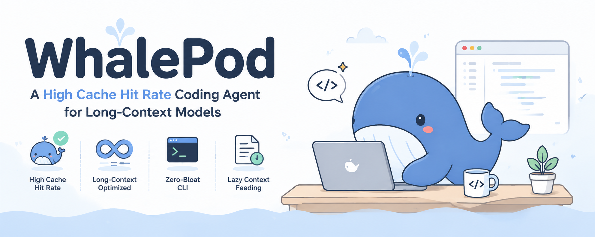
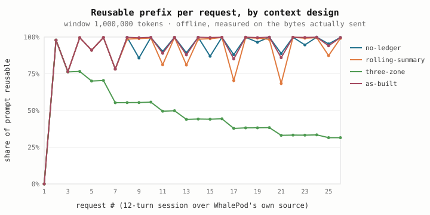
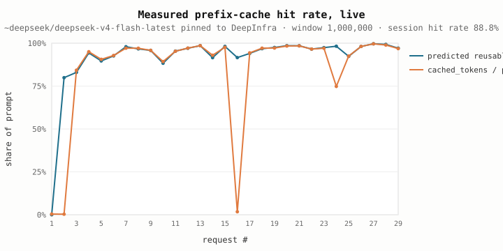

# 🐋 WhalePod

<p align="center">
  
</p>

<p align="center">
  <a href="https://github.com/Timothyhay/whale-pod/blob/main/LICENSE"></a>
  <a href="https://www.python.org/downloads/"></a>
  <a href="https://github.com/Timothyhay/whale-pod"></a>
</p>

A **CLI coding agent** designed for DeepSeek's large-context (up to 1M token)
models — and built to work with any OpenAI-compatible, vLLM, or Anthropic
endpoint.

**Core philosophy:** *context isn't for stuffing — it's for feeding precisely.*
Instead of dumping the whole repo into the context window, WhalePod keeps a
lightweight "known world" (file tree + symbol map) and lazily pulls content
only when the agent needs it. This keeps the request prefix stable so that
**prefix caching** can work its magic (lower latency & cost), and it leaves the
window open for what matters: real reasoning over the code you're changing.

**It's measured, not asserted.** Over 22 complete 12-turn coding sessions
against DeepSeek V4's official API (up to 37 requests each, 1M window):
**median cache hit rate 94.7%** (P10=93.7%, P90=95.3%), offline prediction error
5.5 points. Every number comes from the `bench/` directory and both offline and
live benches re-run with a single command (offline needs no key at all).


## Why the cache actually hits

A prefix cache only pays out if the beginning of the request is
**byte-identical** to last time. That single constraint decides the whole layout.



Four context designs compared off the same 12-turn session on WhalePod's own
source tree. **as-built** (two-zone + append-only + ledger) stays at 99.6% and
dips to 76–89% only when new file content arrives — the sawtooth is the only
thing you should ever pay full price for. **no-ledger** hits nearly the same
rate (93.7% vs 94.2%) but ships **20% more tokens** (1.1M vs 911k) — a high hit
rate on a bloated prompt is still an expensive prompt. **three-zone** decays to
31.5% because every turn mutates the tail of the prefix; it was deleted before
it was written.

Then the same session, run live against DeepSeek V4's official API:



30+ of 37 requests above 90%, dips only at turn boundaries where new file
content enters the window — recovered on the very next request to 94%+. Offline
prediction tracks the server to **5.5 points** MAE.

The effect holds across conversation lengths: 6 turns → 91.7%, 12 → 94.7%, 18 →
95.0%. At the V4 Flash token price that's roughly **$0.02/session** in prompt
cost. 

Two conditions this rests on: **pin the provider** (a prefix cache is state on
*one machine* — unpinned routing measured 0.4% hits vs 98.4% pinned) and **put
the volatile part last**.


## Highlights

- **Two-zone context** — byte-stable prefix (tool defs + system prompt + repo
  map) and append-only history. Prompt sits *before* the map to limit the blast
  radius of a refresh. History is never rewritten in place.
- **Context ledger** — file content enters the window once. A repeat read of an
  unchanged range returns a short pointer instead of the file, invalidated when
  the file changes on disk or WhalePod edits it.
- **Provider affinity** — a prefix cache is state on *one machine*. An aggregator
  that routes to different providers each time turns the cache into a zero.
  `extra_body` pins the provider; `allow_fallbacks: false` prevents silent cost
  regression.
- **Compaction over pruning** — reduction happens at `min(window × prune_at,
  window − reserve_tokens)` with one small model call to summarize the cut turns
  into a structured file list + line ranges. Fails back to prune; your turn never
  fails.
- **Measured cache telemetry** — hit rate comes from the server's `usage`
  block, not an estimate. When the provider says nothing, WhalePod says
  "unmeasured" instead of inventing a number.
- **Tools carry their own rules** — each tool definition has `guidelines`, and
  the "Using the tools" section is derived from the tools actually on offer. A
  readonly session drops the write tools *and* their instructions.
- **Line endings survive a round trip** — files normalized to LF for matching
  and restored on write, so a CRLF checkout doesn't make every multi-line edit
  fail.
- **Snapshot safety** — each session writes a manifest so `whalepod rollback
  --session <id>` works from a fresh process.


## Quickstart

```bash
pip install -e ".[treesitter]"
whalepod auth            # configure endpoint + key
whalepod                 # start the REPL
```

`/help` lists commands. `/mode` toggles thinking/instant.


## Configuration

Config is merged from global (`~/.whalepod/config.json`) → project
(`./.whalepod.json`) → CLI flags.

```json
{
  "endpoint": {
    "type": "vllm",                // vllm | openai | anthropic
    "base_url": "https://openrouter.ai/api",
    "model": "~deepseek/deepseek-v4-flash-latest",
    "api_key_env": "OPENROUTER_API_KEY",
    "extra_body": {
      "provider": { "order": ["DeepInfra"], "allow_fallbacks": false }
    }
  },
  "default_mode": "thinking",
  "sandbox": "confirm",            // confirm | readonly | yes | none
  "repo_map": {
    "languages": ["python", "typescript", "go"],
    "max_tokens": 0,               // 0 = auto: ~1.5% of the window, 4k–16k
    "exclude": ["reference"]
  },
  "context_window": 1000000,
  "prune_at": 0.90,
  "reserve_tokens": 16384,
  "prune_to": 0.50,
  "compaction": true,
  "compaction_max_tokens": 2000
}
```

**Using an aggregator? Set `extra_body` to pin the provider.** KV cache is
per-machine; free routing measured 0.4% hits vs 98.4% pinned. `allow_fallbacks:
false` means a silent reroute can't quietly cost you the whole cache.

API keys resolve from: flags → `api_key_env` → `WHALEPOD_API_KEY` → provider
defaults → `~/.whalepod/config.json` → `whalepod auth`. Never logged.


## Commands

| Command | |
|---|---|
| `whalepod` | Interactive REPL |
| `whalepod ask <prompt>` | One-shot answer (`--model`, `--mode`, `--yes`) |
| `whalepod auth` | Configure endpoint + API key |
| `whalepod repo-map` | Build and print the symbol map |
| `whalepod context-stats` | Stable prefix cost + reduction threshold |
| `whalepod tokens <text>` | Rough token count |
| `whalepod rollback [--session ID]` | Restore pre-edit snapshots |
| `whalepod config` | Show resolved config (key redacted) |

**REPL commands:** `/mode` · `/stats` · `/context` · `/refresh` · `/rollback` ·
`/clear` · `/help` · `/quit`


## Development

```bash
pip install -e ".[treesitter,tokenizer,dev]"
python bench/fetch_tokenizer.py                 # download V4 tokenizer once
python -m unittest discover -s tests -q         # 236 tests, no network
python bench/validate.py --out bench/results    # offline cache regression, seconds
```

Every test pins a bug that actually happened. `test_prompt.py` asserts the
cached prefix is **byte-identical** across builds. `bench/validate.py` needs no
network and no key — it measures on the *real* byte stream the server
fast-tokenizes (official encoder + V4 BPE).

## License

MIT
