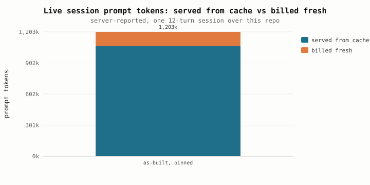

# 🐋 WhalePod

A **CLI coding agent** designed for DeepSeek's large-context (up to 1M token)
models — and built to work with any OpenAI-compatible, vLLM, or Anthropic
endpoint.

**Core philosophy:** *context isn't for stuffing — it's for feeding precisely.*
Instead of dumping the whole repo into the context window, WhalePod keeps a
lightweight "known world" (file tree + symbol map) and lazily pulls content
only when the agent needs it. This keeps the request prefix stable so that
**prefix caching** can work its magic (lower latency & cost), and it leaves the
window open for what matters: real reasoning over the code you're changing.

**It's measured, not asserted.** Over 22 complete 12-turn coding sessions
against DeepSeek V4's official API (up to 37 requests each, 1M window):

| | |
|---|---|
| Cache hit rate | **median 94.7%** (P10=93.7%, P90=95.3%) |
| Prompt cost | $0.10828 uncached → **$0.02020** offline-estimated, per session |
| Hit rate over time | first 3 requests 87.1% → **last 3 98.2%** |
| Starting context | **~15,269 tokens** — a symbol map, not the repo |
| Offline prediction error | **mean absolute error 5.5 points** (was 7.0 with the old tokenizer) |

(Prompt tokens only — caching does nothing for output, and comparing a
prompt+completion total against a prompt-only baseline would be mixing two
things. The 22-run aggregate is in `bench/results/live_acceptance.json`
alongside per-request detail, charts, and the full report.)

Every number above comes out of `bench/`, and the raw evidence ships with the
repo: per-request token counts and the price list used are in
`bench/results/live_acceptance.json`, the charts are the `.svg` files beside it,
and both benches re-run with one command (see
[Development](#development)) — offline needs no key at all.

---

## Why the cache actually hits

A prefix cache only pays out if the beginning of the request is **byte-identical**
to last time. That single constraint decides the whole layout, so the first thing
built was a bench that replays one 12-turn session through four different context
designs and measures the reusable prefix on the bytes actually sent.


This is the argument in one picture. Read the *shape*, not just the height:

- **as-built** pins at 99.6% and dips to 76–89% exactly when new file content
  arrives — the sawtooth is the only thing you should ever pay full price for.
- **three-zone** starts at 97.9% and **decays to 31.5%**. Putting a volatile
  "working set" zone *after* the history means every turn pushes more bytes
  behind the mutation point, so the tail of the prefix is re-billed every time.
  That design was deleted before it was written; this chart is why.
- **no-ledger** looks almost as good by *rate* (93.7% vs 94.2%) while shipping
  **20% more tokens** (1,099,805 vs 911,083). A high hit rate on a bloated
  prompt is still an expensive prompt — which is why hit rate is treated here as
  a cost metric, never a scorecard.

Then the same session, run against DeepSeek V4's official API:


Requests #1–#3 near zero is **correct** — there is nothing to hit yet. From #4 it
sits at 89–99.7%, **30+ of 37 requests above 90%**, with the only dips occurring
at turn boundaries where new file content enters the window — and recovering on
the very next request to 94%+. Offline prediction tracks the server to a mean
absolute error of **5.5 points** (down from 7.0 before switching to the V4
tokenizer and official chat encoding). The
[full experiment report](docs/bench_eval.md) covers 22 independent
sessions at 12 turns: median hit rate **94.7%**, P10=93.7%, P90=95.3%; plus
additional experiments at 6 turns (**91.7%**) and 18 turns (**95.0%**).

DeepSeek's official API delivers better cache consistency than an aggregator:
no unexplained collapses at arbitrary points, and the sawtooth pattern is
exactly what the offline model predicts. **A hit rate is a cost number, not a
correctness number**, so nothing in the agent assumes the cache is there.



In the first session alone: of 1,732,599 prompt tokens, 1,640,960 came from
cache and only 91,639 were billed fresh. Across 22 sessions at the V4 Flash
token price that is roughly **$0.02/session** in prompt cost — less than a
single request would cost without the cache.

Two conditions this rests on, both learned the hard way:
**pin the provider** (a prefix cache is state on one machine — unpinned routing
measured 0.4% against 98.4% pinned), and **put the volatile part last**.

The remaining case is a forced context reduction, which necessarily breaks the
prefix. It costs one request and then recovers: live at a 63,000-token window
(`live_prune.svg`), the prune landed on request #18 at 0.2% and #19 was back to
95.0%, ending the session at 85.1% overall. Offline at 52,000
(`prune_recovery.svg`), one prune still leaves 92.4% of the session's prefix
reusable. That is the whole price of reduction, measured.

---

## Highlights

- **Two-zone context management** — a byte-stable prefix (tool defs + one system
  message holding the prompt then the repo map) and append-only history. The
  prompt sits *before* the map, so refreshing the map only invalidates the map's
  own tokens. History is never rewritten in place.
- **Context ledger** — file content enters the window once. A repeat read of an
  unchanged range returns a short pointer instead of the file, and the entry is
  invalidated when the file changes on disk or WhalePod edits it. What actually
  wastes a 1M window is the same file arriving three times.
- **Measured cache telemetry, not guesses** — hit rate comes from the server's
  `usage` (DeepSeek `prompt_cache_hit_tokens`, OpenAI/vLLM
  `prompt_tokens_details.cached_tokens`, Anthropic `cache_read_input_tokens`).
  When the provider reports nothing, WhalePod says "unmeasured" rather than
  inventing a number.
- **Provider affinity is a precondition, not a tuning knob** — a prefix cache is
  state on *one machine*. Routed to a different provider by an aggregator, the
  identical second request measured **0.4%** hits; pinned, **98.4%**. Not a
  discount — a zero. `extra_body` pins the provider, with `allow_fallbacks:
  false` so a silent reroute can't quietly cost you 68% of your savings.
- **Compaction first, pruning as the fallback** — reduction happens above
  `min(window × prune_at, window − reserve_tokens)` (the absolute floor matters:
  32k × 0.9 leaves 3.2k, which doesn't fit one reasoning reply). Both paths use
  the *same* cut point and cost the same cache-wise, so compaction just pays one
  small call to carry the goal, state, files touched and next step across the
  gap — injected as a user message, never disguised as the model's own words. If
  the summarizer fails, it degrades to the blind prune; your turn never fails.
  Either way the ledger's entries for dropped content are retracted, because a
  pointer to a pruned file points at nothing.
- **Repo Map (Tree-sitter) on a token budget** — a compact AST-backed symbol
  table (classes, functions, interfaces, types) lives in the stable prefix,
  bounded in *tokens* (auto-scaled to ~1.5% of the window) rather than in symbol
  count, because 2,000 TypeScript signatures cost 35× what the count suggests.
  The budget is shared fairly across top-level directories, so a vendored
  subtree can't crowd out your own source, auxiliary trees (`tests/`, `docs/`)
  yield to it, and anything cut is *reported* instead of silently dropped.
  Falls back to regex for languages without a grammar installed.
- **Lazy Loading** — the agent starts with only the file tree + symbol map, then
  loads files on demand through tools (`read_file`, `read_dir`, `grep`, …).
- **Usage rules live on the tool, not in the prompt** — each tool definition
  carries its own `guidelines`, and the "Using the tools" section is *derived*
  from the tools actually on offer. A new tool can't ship without its rules, and
  a readonly session drops the write tools *and* the three paragraphs about
  editing files. (Guidelines are stripped from the wire schema — some providers
  400 on an unknown key — and the enabled set is fixed for the session, because
  a re-worded schema is a full cache miss.)
- **Truncation that tells you how to get the rest** — reads cut from the top
  (line 1 is the top of the file) and report the range you actually got, with
  the next call written out for you: `Continue with read_file(path='big.py',
  start=101)`. Command output cuts from the *front*, keeping the tail where the
  traceback and exit status are, and the full text spills to a file **under the
  sandbox root** so the model can `grep` it — a 200MB log becomes searchable at
  a cost of zero context tokens. Line and byte budgets are enforced separately,
  whichever hits first.
- **Line endings and BOM survive a round trip** — files are normalized to LF for
  matching and restored on write. Without this, every multi-line edit on a CRLF
  checkout fails with "`old` text not found", and re-reading the file doesn't
  help because the read output is LF too.
- **Thinking ⇄ Instant modes** — Thinking streams the model's `reasoning` for
  local display; Instant skips it for snappy Q&A. Toggle live with `/mode`.
  Chain-of-thought is never replayed upstream.
- **Plan, confirm, then write** — write tools compute the change without
  touching disk, you approve the real diff, and only then is it committed
  (atomically, preserving line endings). Multi-file patches are all-or-nothing.
  With no confirmation handler attached, writes are *refused*, not auto-approved.
- **Two-tier command guard** — command lines are split on shell operators
  (quote-aware) and every segment is classified, so a benign prefix can't hide
  anything. Sensitive commands need an explicit OK; a small deny tier
  (`mkfs`, `dd of=/dev/…`, `rm -rf /`, force-push, …) is refused in *every* mode,
  including `--yes`.
- **Snapshot rollback that survives the process** — each session writes a
  `manifest.json`, so `whalepod rollback --session <id>` works from a fresh
  process, not just the one that made the edits.
- **Multi-provider** — vLLM / OpenAI-compatible / OpenRouter / Anthropic,
  configurable. Anthropic's explicit `cache_control` is stamped onto the stable
  prefix.
- **Project instructions** — `WHALEPOD.md`, `.whalepod.md`, `AGENTS.md` or
  `CLAUDE.md` (first non-empty wins, and it prints which one it used). Those
  files hold this repo's build command, how to run the tests, the code style —
  ignoring them means rediscovering all of it every session.

---

## Quickstart

```bash
# install (with tree-sitter backends for best Repo Map accuracy)
pip install -e ".[treesitter]"

# configure your endpoint + key
whalepod auth

# start the REPL
whalepod
```

Then just type like you would to any coding assistant. `/help` lists commands.

### One-shot

```bash
whalepod ask "Refactor src/auth.py to use async"
whalepod ask "What does authenticate_token do?" --mode instant
```

---

## Configuration

Config is merged from global → project → CLI flags:

- Global: `~/.whalepod/config.json`
- Project: `./.whalepod.json`

```json
{
  "endpoint": {
    "type": "vllm",                // vllm | openai | anthropic
    "base_url": "https://openrouter.ai/api",
    "model": "~deepseek/deepseek-v4-flash-latest",
    "api_key_env": "OPENROUTER_API_KEY",
    "extra_body": {                // merged into the request body verbatim
      "provider": { "order": ["DeepInfra"], "allow_fallbacks": false }
    }
  },
  "default_mode": "thinking",
  "sandbox": "confirm",            // confirm | readonly | yes | none
  "repo_map": {
    "languages": ["python", "typescript", "go"],
    "max_tokens": 0,               // 0 = auto: ~1.5% of the window, 4k–16k
    "exclude": ["reference"]       // extra ignores, on top of .gitignore
  },
  "context_window": 1000000,
  "prune_at": 0.90,                // reduce above this fill fraction...
  "reserve_tokens": 16384,         // ...or when this little headroom is left,
                                   //    whichever comes first
  "prune_to": 0.50,                // reduce down to this fill in one pass
  "compaction": true,              // summarize at the cut point (false = blind prune)
  "compaction_max_tokens": 2000    // budget for the summary itself
}
```

`base_url` is the host root — the provider adapter appends `/v1/chat/completions`
or `/v1/messages`. There is no built-in default for `vllm`: a self-hosted,
dedicated or aggregator endpoint has to be configured, and `whalepod` says so up
front rather than failing mid-request.

**If you go through an aggregator, set `extra_body` to pin the provider.** Prefix
caching is per-machine state; free routing measured a 0.4% hit rate where pinning
gave 98.4%. `allow_fallbacks: false` is deliberate — better a failed request you
retry than a silent reroute that costs you the whole cache and never says why.

### API keys

Resolution order:

1. `--api-key` / `--endpoint` flags
2. `api_key_env` from the config (e.g. `OPENROUTER_API_KEY`), then
   `WHALEPOD_API_KEY`, then provider defaults (`OPENAI_API_KEY`,
   `ANTHROPIC_API_KEY`, `HF_TOKEN`)
3. `~/.whalepod/config.json`
4. Interactive `whalepod auth`

Keys are never logged and never written to shell history. (Local/public test
endpoints that don't require real auth — like a self-hosted vLLM — accept a
placeholder key like `dummy`.)

---

## Command reference

| Command | Description |
|---|---|
| `whalepod` | Interactive REPL |
| `whalepod ask <prompt>` | One-shot answer |
| `whalepod auth` | Configure endpoint + API key |
| `whalepod repo-map [--max-tokens N]` | Build and print the symbol map + its token cost |
| `whalepod context-stats` | What the stable prefix costs for this repo + the reduction threshold actually in effect |
| `whalepod tokens <text>` | Rough token count |
| `whalepod rollback [--session ID] [--list]` | Restore pre-edit snapshots |
| `whalepod config` | Show resolved config (key redacted) |

`ask` also takes `--model`, `--mode`, `--max-tokens`, `--yes` (auto-approve
writes, unattended) and `--no-tools`.

**REPL commands:** `/mode` toggle thinking/instant · `/stats` (context fill +
*measured* cache hit rate) · `/context` (what the ledger has delivered) ·
`/refresh` (rescan the repo map) · `/rollback` · `/clear` · `/help` · `/quit`

---

## Architecture

```
whalepod/
├── cli.py             # click CLI + REPL (printed transcript + one status line)
├── config.py          # config + API key resolution
├── core/
│   ├── agent.py       # agent loop (stream → plan/confirm → tools → loop)
│   ├── messages.py    # two-zone prefix-caching store + reduction planning
│   ├── compaction.py  # summarize at the cut point (falls back to pruning)
│   ├── ledger.py      # context ledger (what the model has already been shown)
│   ├── prompt.py      # system prompt (derived from the tool set) + repo map
│   └── tokenizer.py   # local token estimator
├── endpoints/         # multi-provider abstraction
│   ├── base.py        # unified request/delta models + ABC
│   ├── factory.py     # build the endpoint from config
│   ├── vllm.py        # OpenAI-compatible / vLLM / OpenRouter
│   ├── openai.py
│   └── anthropic.py   # protocol conversion + explicit cache_control
├── context/
│   ├── repo_map.py    # Tree-sitter AST symbol table + compact renderer
│   └── grammar.py     # grammar loading (treesitter / regex fallback)
├── tools/
│   ├── registry.py    # tool definitions (with their guidelines) + dispatch
│   ├── base.py        # ToolResult + the three truncation shapes
│   ├── plan.py        # WritePlan — compute before write
│   ├── read.py  edit.py
│   └── textfile.py    # line-ending / BOM normalize + restore
├── sandbox/           # path guard, command classification, snapshots/rollback
└── ui/                # rendering helpers (diffs, stats, the status line)

bench/
├── validate.py         # offline: four context designs compared byte-by-byte
├── live_acceptance.py  # live: real calls, real usage numbers
├── charts.py           # SVG + ASCII chart output
├── dsv4_encoding.py    # DeepSeek V4 official chat encoder (vendored from HF, MIT)
└── fetch_tokenizer.py  # one-time download of V4's tokenizer.json for accurate counting
```

The design rationale is written where it applies: `core/messages.py` explains the
two-zone store, `core/compaction.py` why compaction beats a blind prune,
`ui/render.py` why there is no full-screen layout, and `bench/validate.py` what
the four compared context designs were. Results live in `bench/results/`
(`validation.txt` and `live_acceptance.txt` are the human-readable ones).

---

## Development

```bash
pip install -e ".[treesitter,tokenizer,dev]"    # tokenizer = accurate V4 BPE counts
python bench/fetch_tokenizer.py                 # download tokenizer.json once
python -m unittest discover -s tests -q         # 236 tests, no network required
python bench/validate.py --out bench/results    # offline cache regression, seconds
```

Every test pins a bug that actually happened; the docstrings say what used to go
wrong. `tests/test_agent.py` drives the agent loop through a scripted fake
endpoint, so confirmation ordering, retry policy and ledger behaviour are all
checked offline. `tests/test_prompt.py` asserts the cached prefix is
**byte-identical** across builds and that nothing session-specific (cwd, temp
paths) leaks into it — the one invariant the whole cost model rests on.

`bench/validate.py` needs no network and no key: it's the regression test for
"did this change break the prefix?" With the V4 tokenizer downloaded it measures
on the *real* byte stream the server fast-tokenizes (official encoder + BPE) —
no approximations.

## License

MIT
